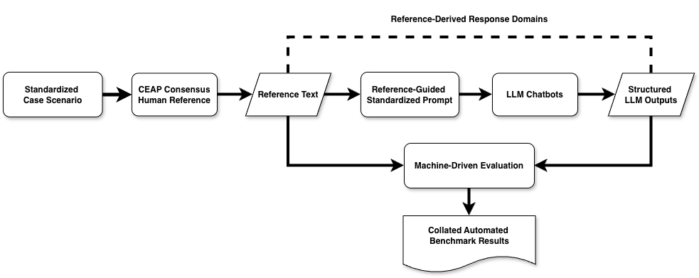

# Benchmarking Chatbot Responses in High-Stakes LGBTQ+ Suicide-Prevention Contexts: An Exploratory Evaluation of Language-Safety Signal and Machine-Human Response Alignment

This repository contains the code used for an exploratory machine-driven benchmark of LLM-based chatbot responses to a high-stakes LGBTQ+ suicide-risk assessment scenario. The project evaluates chatbot outputs against a Community Expert and Accountability Panel (CEAP) consensus reference response using automated metrics that describe machine-readable response patterns.

This code is designed for descriptive benchmarking only. The generated scores should not be interpreted as evidence of clinical safety, therapeutic quality, model superiority, or real-world suicide-prevention effectiveness.

## Project Purpose

The associated manuscript examines how eight LLM-based chatbots respond to a standardized prompt simulating a social worker's help request about suicide-risk assessment with an LGBTQ+ client. The benchmark focuses on seven automated metrics:

1. **ROUGE Lexical Overlap** — lexical content coverage compared with the CEAP reference.
2. **METEOR Lexical-Semantic Alignment** — language-level alignment allowing some wording variation.
3. **Negative Sentiment Probability** — affective-tone signal, not a harm score.
4. **Flesch Reading Ease** — readability/accessibility indicator.
5. **Non-Hateful Language Probability** — basic screen for overt hateful or stigmatizing language.
6. **Crisis-Response Reference Similarity** — semantic similarity to selected crisis-response reference sections.
7. **Risk-Assessment Reference Similarity** — semantic similarity to selected suicide-risk assessment reference sections.

The manuscript positions these metrics as machine-readable indicators rather than measures of clinical competence, LGBTQ+-affirming quality, or safety.

## Workflow Overview



## Code Structure

```text
project-root/
├── main.py
├── src/
│   ├── commonconst.py
│   ├── data/
│   │   ├── Test Reference Text.docx
│   │   ├── Test Chatbot text.docx
│   │   └── data_processing.py
│   ├── utils/
│   │   ├── evaluation_algo.py
│   │   └── output_processing.py
│   └── outputs/
│       ├── evaluation_scores.csv
│       ├── integrated_chatbot_responses.csv
│       ├── processed_chatbot_text.csv
│       ├── processed_reference_text.csv
│       └── Plots/
└── README.md
```

### `main.py`

Main execution script. It runs the full benchmark pipeline:

1. Loads the CEAP reference text and chatbot response text from DOCX files.
2. Processes and saves structured intermediate CSV files.
3. Generates benchmark scores across the seven automated metrics.
4. Appends all benchmark components into one main results table.
5. Saves `evaluation_scores.csv` and benchmark plots.

The current version is benchmark-only and does **not** run inferential statistics, ANOVA, robustness tests, correlation matrices, or sensitivity analyses.

### `src/commonconst.py`

Central configuration file for paths, constants, column names, model settings, topic labels, plotting settings, and metric definitions. Key settings include:

- input file paths for reference and chatbot DOCX files;
- output paths for CSV files and plots;
- canonical response-domain ordering;
- Hugging Face model configurations;
- benchmark metric column names;
- plot size, rotation, and DPI.

### `src/data/data_processing.py`

Processes raw DOCX files into structured CSV data. This module extracts text from the reference and chatbot documents, separates chatbot/platform sections, standardizes response domains, and creates the integrated response file used by the evaluation pipeline.

### `src/utils/evaluation_algo.py`

Core scoring module. It computes:

- ROUGE Lexical Overlap;
- METEOR Lexical-Semantic Alignment;
- Negative Sentiment Probability using a RoBERTa-based sentiment classifier;
- Flesch Reading Ease;
- Non-Hateful Language Probability using a RoBERTa-based hate-speech classifier;
- Crisis-Response Reference Similarity using sentence-transformer embeddings;
- Risk-Assessment Reference Similarity using sentence-transformer embeddings.

It also prepares aggregated chatbot and reference views, builds reference anchors for crisis-response and risk-assessment similarity, chunks long text for classifier models, and saves the final score table.

### `src/utils/output_processing.py`

Generates benchmark visualizations from the final results. The current version saves metric-specific bar plots to `src/outputs/Plots/`. It also cleans deprecated outputs from earlier versions, including stale CSV files or pass/fail figures.

## Inputs

The pipeline expects two DOCX files:

- `src/data/Test Reference Text.docx` — CEAP consensus human reference response.
- `src/data/Test Chatbot text.docx` — chatbot responses organized by chatbot system and response domain.

The standardized response domains include:

- Current Suicidal Ideation
- Risk Assessment
- Nature of Thoughts, Plan, & Access to Means
- Support System & Protective Factors
- Safety Plan
- Risk Re-Assessment
- Other Important Assessment Aspects

## Outputs

Primary outputs are saved under `src/outputs/`:

- `evaluation_scores.csv` — final benchmark table containing all seven metrics.
- `integrated_chatbot_responses.csv` — structured chatbot and reference response data.
- `processed_chatbot_text.csv` — processed chatbot text.
- `processed_reference_text.csv` — processed CEAP reference text.
- `Plots/` — visualizations for each benchmark metric.

## Running the Pipeline

Install the required Python dependencies, place the two input DOCX files in `src/data/`, and run:

```bash
python main.py
```

Expected console output:

```text
Benchmark evaluation complete.
Main results saved to: src/outputs/evaluation_scores.csv
Integrated responses saved to: src/outputs/integrated_chatbot_responses.csv
All plots saved to: src/outputs/Plots
```

## Interpretation Notes

This benchmark should be interpreted cautiously:

- ROUGE and METEOR are content-coverage and lexical-semantic alignment proxies, not clinical quality measures.
- Negative Sentiment Probability is an affective-tone signal. In suicide-risk assessment, more direct language may be classified as more negative even when clinically necessary.
- Non-Hateful Language Probability only screens for overt hateful or stigmatizing language and does not establish LGBTQ+-affirming quality.
- Embedding-based similarity metrics describe semantic alignment with selected reference sections, not correctness or safety.
- Flesch Reading Ease indicates readability/accessibility, not completeness or clinical appropriateness.

The pipeline is intended to support AI auditing, manuscript reproducibility, and structured inspection of chatbot outputs. It does not replace expert review, clinical supervision, validated suicide-risk assessment instruments, or LGBTQ+-informed human judgment.

## Current Manuscript Framing

The associated paper frames the study as an exploratory benchmark. It does not claim that any chatbot is clinically safe, trustworthy, or superior. Instead, it demonstrates how automated metrics can help make AI-generated responses more inspectable across multiple dimensions relevant to social work research, practice, and training.