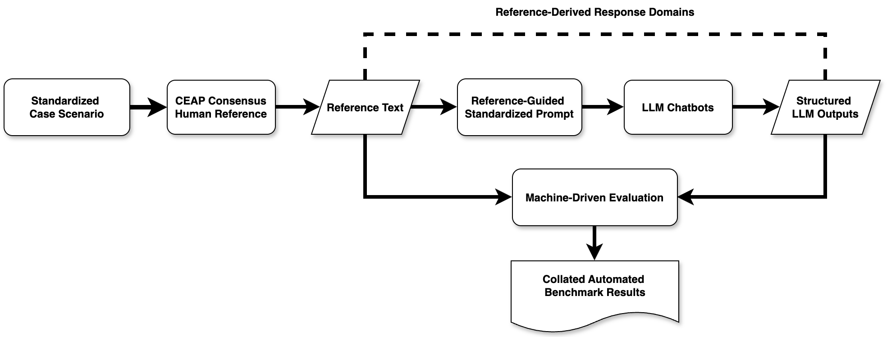

# Benchmarking Chatbot Responses in High-Stakes LGBTQ+ Suicide-Prevention Contexts: An Exploratory Evaluation of Language-Safety Signal and Machine-Human Response Alignment

This repository contains the code for an exploratory, machine-driven benchmark of eight LLM chatbot responses to a standardized LGBTQ+ suicide-risk assessment scenario. Outputs are compared with a Community Expert and Accountability Panel (CEAP) consensus reference using seven automated metrics.

The scores are descriptive, machine-readable indicators. They are not evidence of clinical safety, therapeutic quality, model superiority, or real-world suicide-prevention effectiveness.

## Project Purpose

The associated manuscript asks how eight LLM chatbots respond when a social worker requests help assessing suicide risk for an LGBTQ+ client. The pipeline reports seven metrics:

1. **ROUGE Lexical Overlap** — mean F-measure of ROUGE-1, ROUGE-2, and ROUGE-L against the CEAP reference.
2. **METEOR Lexical-Semantic Alignment** — token alignment that allows some synonym variation.
3. **Negative Sentiment Probability** — P(negative) from `cardiffnlp/twitter-roberta-base-sentiment-latest`. This is an affective-tone signal, not a harm score.
4. **Flesch Reading Ease** — readability formula (0–100).
5. **Non-Hateful Language Probability** — P(not_hate) from `cardiffnlp/twitter-roberta-base-hate-multiclass-latest`.
6. **Crisis-Response Reference Similarity** — sentence-level coverage of selected crisis-response reference domains.
7. **Risk-Assessment Reference Similarity** — sentence-level coverage of selected risk-assessment reference domains.

These metrics describe inspectable response patterns. They do not measure clinical competence, LGBTQ+-affirming quality, or safety.

## How Scoring Works

**Scoring domains.** ROUGE, METEOR, Negative Sentiment, and Flesch are macro-averaged over the seven domains that appeared in the standardized prompt (`SCORING_TOPICS` in `src/commonconst.py`):

- Current Suicidal Ideation
- Risk Assessments
- Nature of Thoughts, Plan, & Access to Means
- Support System & Protective Factors
- Safety Plan
- Risk Re-Assessment
- Other important assessment aspects

A topic with empty response text after cleaning is skipped, so the average is over covered domains only. `Risk Level Interpretation` and `Note` appear in the CEAP reference but were never requested in the prompt; they are not scored. Chatbot and human-reference values for Negative Sentiment and Flesch use this same seven-domain set.

**Similarity.** Crisis-response similarity uses the reference text in *Risk Assessments*, *Support System & Protective Factors*, and *Other important assessment aspects*. Risk-assessment similarity uses *Nature of Thoughts, Plan, & Access to Means*, *Safety Plan*, and *Risk Re-Assessment*. For each pair of texts the pipeline:

1. splits both sides into sentences;
2. encodes them with `sentence-transformers/all-mpnet-base-v2` (`normalize_embeddings=True`);
3. takes, for each **reference** sentence, the maximum cosine over response sentences;
4. returns the mean of those maxima as raw cosine (no `(sim + 1) / 2` rescaling).

The construct is asymmetric: does the response cover the reference?

**What the pipeline does not do.** It does not use keyword lists, lexicons, or regex term lists. It does not run inferential tests beyond the encoder rank-agreement columns described below. It does not produce pass/fail ethical-alignment scores.

## Workflow Overview



## Code Structure

```text
project-root/
├── main.py
├── requirements.txt
├── src/
│   ├── commonconst.py
│   ├── data/
│   │   ├── Test Reference Text.docx
│   │   ├── Test Chatbot Text.docx
│   │   └── data_processing.py
│   ├── utils/
│   │   ├── evaluation_algo.py
│   │   └── output_processing.py
│   └── outputs/
│       ├── evaluation_scores.csv
│       ├── integrated_chatbot_responses.csv
│       ├── processed_chatbot_text.csv
│       ├── processed_reference_text.csv
│       └── Plots/
└── README.md
```

### `main.py`

Runs the full pipeline: load the two DOCX inputs, write intermediate CSVs, score the seven reported metrics plus supplementary columns, merge everything into `evaluation_scores.csv`, and save one bar plot per reported metric.

### `src/commonconst.py`

Paths, the seven scoring domains, column names, Hugging Face model IDs, supplementary encoder prefixes, and plot settings.

### `src/data/data_processing.py`

Extracts text from the reference and chatbot DOCX files, splits responses by platform and domain, and writes the integrated table used for scoring.

### `src/utils/evaluation_algo.py`

Computes all scores. Classifiers chunk long text to the model context length. Embedding models are loaded once and cached.

### `src/utils/output_processing.py`

Writes one plot per reported metric to `src/outputs/Plots/`. Similarity plots use a fixed y-axis of 0 to 1. Supplementary columns are not plotted.

## Inputs

Both input files are included in this repository:

- `src/data/Test Reference Text.docx` — CEAP consensus human reference.
- `src/data/Test Chatbot Text.docx` — the eight chatbot responses, organized by system and domain.

On case-sensitive filesystems the chatbot filename must be `Test Chatbot Text.docx` (capital T).

## Outputs

All results are extra columns of `src/outputs/evaluation_scores.csv`. The pipeline does not write additional CSV files.

**Reported columns** (names are stable):

- `ROUGE Lexical Overlap`
- `METEOR Lexical-Semantic Alignment`
- `Negative Sentiment Probability`
- `Non-Hateful Language Probability`
- `Crisis-Response Reference Similarity`
- `Risk-Assessment Reference Similarity`
- `Flesch Reading Ease`

Human-reference counterparts are stored as `Reference Negative Sentiment Probability`, `Reference Flesch Reading Ease`, and `Reference Non-Hateful Language Probability`.

**Transparency and sensitivity columns:**

- `Topics Scored` — how many of the seven prompted domains contributed to that system's macro average.
- `Topics Excluded` — semicolon-joined domain names the system produced that fall outside `SCORING_TOPICS`.
- `ROUGE / METEOR / Negative Sentiment / Flesch … (legacy zero-filled)` — previous scoring rule: empty domains entered the average as 0.0, over all nine reference topics.
- `Reference Negative Sentiment Probability (legacy 9-topic)` and `Reference Flesch Reading Ease (legacy 9-topic)` — human-reference values under that same nine-topic rule.

**Supplementary columns** (not among the seven reported metrics):

- `Non-Hateful Language Probability [unitary/unbiased-toxic-roberta]` — 1 minus the model's `identity_attack` probability, using the same classifier path as the reported non-hateful score.
- `Crisis-Response / Risk-Assessment Reference Similarity [BAAI/bge-large-en-v1.5]` and `[intfloat/e5-large-v2]` — the same sentence-level coverage operator with additional encoders. For e5 the reference is prefixed with `query: ` and the response with `passage: `.
- `Crisis-Response Rank Agreement` and `Risk-Assessment Rank Agreement` — mean pairwise Spearman rank correlation of the eight-chatbot ranking across the primary encoder and the two supplementary encoders (the same scalar on every row).

Plots (one per reported metric) are written to `src/outputs/Plots/`. Intermediate text tables are `integrated_chatbot_responses.csv`, `processed_chatbot_text.csv`, and `processed_reference_text.csv`.

## Running the Pipeline

Install the packages in `requirements.txt`. The scoring path also needs `sentence-transformers` (used for the three embedding models). From the repository root:

```bash
python main.py
```

Expected console output:

```text
Benchmark evaluation complete.
Main results saved to: src/outputs/evaluation_scores.csv
Integrated responses saved to: src/outputs/integrated_chatbot_responses.csv
All plots saved to: src/outputs/Plots
```

The first run downloads several Hugging Face models (`all-mpnet-base-v2`, `bge-large-en-v1.5`, `e5-large-v2`, and the three sequence classifiers) and is slow. Later runs reuse the local cache.

## Interpretation Notes

- ROUGE and METEOR are lexical coverage proxies. Unprompted extra sections used to inflate scores under the legacy zero-filled rule; the current average excludes those sections.
- Negative Sentiment Probability is an out-of-domain social-media classifier applied to clinical questions. Direct risk-assessment language can be scored as more negative. Human-versus-chatbot comparisons are only valid when both sides use the same seven scoring domains.
- Non-Hateful Language Probability screens for overt hateful language. Saturation near 1.0 on two independent classifiers is a finding about the metric, not proof of affirming care.
- Crisis- and risk-assessment similarity measure coverage of selected reference sentences, not correctness or safety. Encoder rank agreement is a check on whether the eight-system ranking is stable; low agreement means ranks should not be reported.
- Flesch Reading Ease is a surface readability formula, not completeness or clinical appropriateness.

The pipeline supports manuscript reproducibility and structured inspection of chatbot outputs. It does not replace expert review, clinical supervision, validated suicide-risk instruments, or LGBTQ+-informed human judgment.

## Manuscript Framing

The associated paper is an exploratory benchmark. It does not claim that any chatbot is clinically safe, trustworthy, or superior. It shows how a small set of automated metrics can make AI-generated crisis-assessment responses more inspectable — and where those metrics fail — for social work research, practice, and training.
